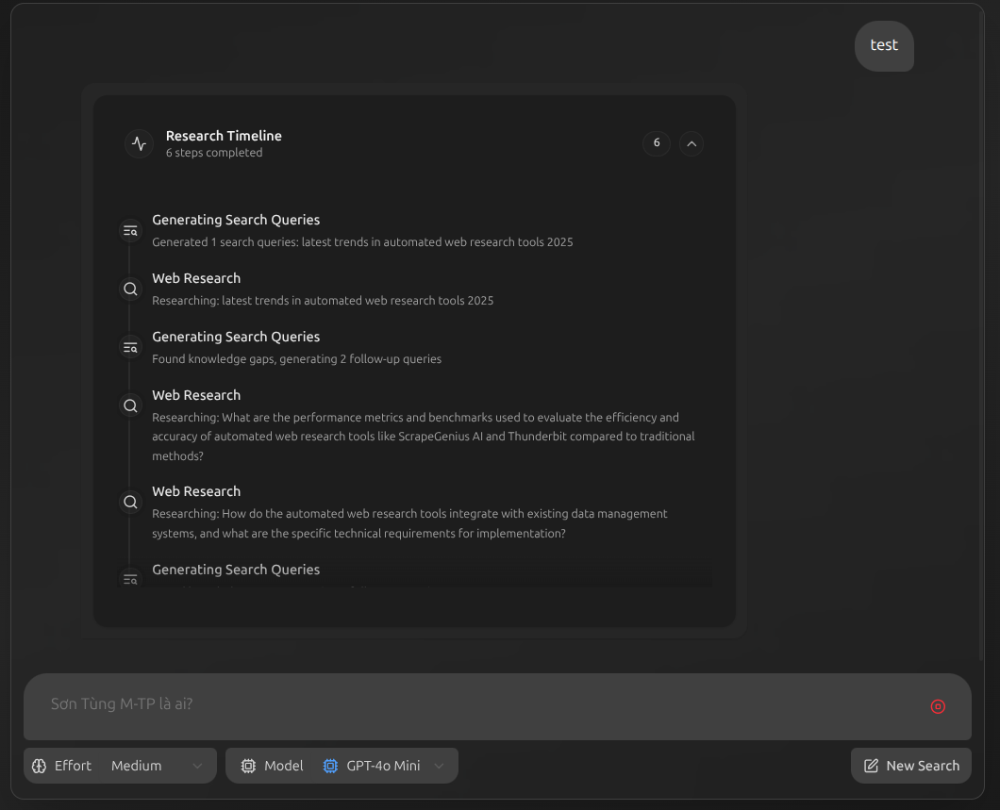

# OpenLoop Resear## 🏗️ Architecture

```
🔄 Single Agent Research Flow
├── 📝 Question Input
├── 🧠 Generate Queries     (Create optimized search queries)
├── 🔍 Web Search          (Tavily API + OpenAI processing) 
├── 🤔 Reflection          (Identify knowledge gaps)
├── 🔄 Iterative Loops     (Continue until sufficient)
└── ✅ Answer Generation   (Synthesized response with sources)
```

**Research Loop Process:**
1. **Question** → Generate multiple search queries
2. **Web Search** → Gather information from multiple sources  
3. **Reflection** → Analyze if more research needed
4. **Loop or Finish** → Continue searching or generate final answernt

A powerful AI research assistant built with LangGraph and OpenAI, featuring real web search capabilities and beautiful modern UI. Get comprehensive, well-sourced answers to any question with live web data.



## ✨ Features

- 🤖 **Intelligent Agent**: Advanced reasoning with iterative research loops
- 🌐 **Real Web Search**: Integrated Tavily API for current information
- 🔍 **Smart Query Generation**: Automatically creates optimized search queries
- 📚 **Source Citations**: Real URLs with proper attribution
- 🎯 **Quality Control**: Reflection and validation mechanisms
- � **Modern UI**: Clean, responsive interface with real-time timeline
- 🌍 **Multi-language**: Responds in user's language (Vietnamese/English)
- ⚡ **Fast & Reliable**: Optimized single-agent architecture

## 🏗️ Architecture

```
� Single Agent Research Flow
├── � Query Generation    (Create optimized search queries)
├── 🔍 Web Research       (Tavily API + OpenAI processing) 
├── 🤔 Reflection        (Identify knowledge gaps)
├── 🔄 Iterative Loops   (Continue until sufficient)
└── ✅ Final Answer      (Synthesized response with sources)
```

## 🚀 Quick Start

### Prerequisites
- Node.js 18+ and npm
- Python 3.11+
- OpenAI API key
- Tavily API key (optional, for real web search)

### 1. Backend Setup

```bash
cd backend

# Install dependencies
pip install -e .

# Set environment variables
echo "OPENAI_API_KEY=your_openai_api_key" > .env
echo "TAVILY_API_KEY=your_tavily_api_key" >> .env  # Optional for real search

# Start backend server
python -m agent.app
# Backend will run on http://localhost:2024
```

### 2. Frontend Setup

```bash
cd frontend

# Install dependencies
npm install

# Start development server
npm run dev
# Frontend will run on http://localhost:5173
```

### 3. Access the Application

Open your browser and navigate to:
- **Application**: http://localhost:5173
- **API Documentation**: http://localhost:2024/docs
- **Health Check**: http://localhost:2024/health

## 🔧 Configuration

### Environment Variables

**Option 1: Use .env file (recommended for development)**
```bash
# Create backend/.env file
echo "OPENAI_API_KEY=your_openai_api_key_here" > backend/.env
echo "TAVILY_API_KEY=your_tavily_api_key_here" >> backend/.env
```

**Option 2: Use system environment (if already in bashrc/zshrc)**
```bash
# If you already have these in your shell profile:
export OPENAI_API_KEY=your_openai_api_key_here
export TAVILY_API_KEY=your_tavily_api_key_here

# No need to create .env file - app will read from environment
```

**Option 3: Runtime export**
```bash
export OPENAI_API_KEY=your_key
export TAVILY_API_KEY=your_key
python -m agent.app
```

### Research Settings

Adjust research intensity in the UI:
- **Low**: 1 query, 1 loop (fast, basic)
- **Medium**: 3 queries, 3 loops (balanced)
- **High**: 5 queries, 10 loops (comprehensive)

## 📦 Production Deployment

### Prerequisites

- Docker & Docker Compose (recommended)
- Node.js 18+ & npm (for manual deployment)
- Python 3.11+ & pip (for manual deployment)

### Quick Start

1. **Clone & Setup**
```bash
git clone <your-repo>
cd openloop
```

2. **Environment Configuration (Choose one option)**

**Option A: If API keys already in bashrc/environment**
```bash
# Skip this step - app will read from your environment variables
echo $OPENAI_API_KEY  # Should show your key
```

**Option B: Create .env file**
```bash
cp backend/.env.example backend/.env
nano backend/.env  # Add your API keys
```

3. **Production Readiness Check**
```bash
./check-production.sh
```

4. **Deploy**

**Option A: With Docker (Recommended)**
```bash
./deploy.sh  # Uses Docker Compose
```

**Verify deployment:**
```bash
./verify-deployment.sh  # Check if everything is working
```

**Option B: Manual Development**
```bash
# Backend (Terminal 1)
cd backend && python -m agent.app

# Frontend (Terminal 2)  
cd frontend && npm run dev
```

**Option C: Manual Production**
```bash
# Backend production
cd backend && python -m agent.app

# Frontend production (different terminal)
cd frontend && npm run preview
```

5. **Access Application**
- Application: http://localhost:3000/app/
- API Docs: http://localhost:3000/docs
- Health Check: http://localhost:3000/health

## 🌐 **Share with Friends**

**For demo/sharing (no cost):**
```bash
# Option 1: Ngrok (create public tunnel)
# Install: https://ngrok.com/download
ngrok http 3000
# Share the https://xyz.ngrok.io/app/ link

# Option 2: GitHub Codespaces (60h free/month)
# Push to GitHub and create Codespace
# Port 3000 will auto-forward with public URL
```

See `SHARING_GUIDE.md` for detailed instructions.

## 🎛️ Usage

1. **Ask any question** in Vietnamese or English
2. **Choose research effort** (Low/Medium/High)
3. **Select AI model** (GPT-4o Mini recommended)
4. **Watch the timeline** as research progresses
5. **Get comprehensive answers** with real source citations

### Example Queries

```
Sơn Tùng M-TP là ai?
What are the latest developments in AI?
How does quantum computing work?
Compare React vs Vue.js in 2025
```

## 🏗️ Technical Details

### Stack
- **Backend**: FastAPI + LangGraph + OpenAI + Tavily
- **Frontend**: React + TypeScript + Vite + TailwindCSS
- **Search**: Tavily API (real-time web search)
- **AI**: OpenAI GPT models (4o-mini recommended)

### Key Files
```
backend/
├── src/agent/
│   ├── app.py              # FastAPI application
│   ├── graph.py            # LangGraph research flow
│   ├── prompts.py          # AI prompts
│   └── configuration.py    # Settings
frontend/
├── src/
│   ├── App.tsx             # Main application
│   ├── components/         # UI components
│   └── lib/               # Utilities
## 📚 API Usage

### REST API

```python
import requests

# Research query
response = requests.post("http://localhost:2024/research", json={
    "query": "Latest AI developments in healthcare", 
    "max_research_loops": 3,
    "reasoning_model": "gpt-4o-mini"
})

result = response.json()
print(f"Answer: {result['answer']}")
print(f"Sources: {result['sources']}")
```

### Streaming API

```python
import requests

# Stream research progress
response = requests.post("http://localhost:2024/runs/stream", 
    json={
        "assistant_id": "agent",
        "input": {
            "messages": [{"type": "human", "content": "Your question"}],
            "max_research_loops": 3
        }
    },
    stream=True
)

for line in response.iter_lines():
    if line.startswith(b'data: '):
        data = json.loads(line[6:])
        print(data)
```

## 🤝 Contributing

1. Fork the repository
2. Create your feature branch (`git checkout -b feature/amazing-feature`)
3. Commit your changes (`git commit -m 'Add amazing feature'`)
4. Push to the branch (`git push origin feature/amazing-feature`)
5. Open a Pull Request

## 📄 License

This project is licensed under the MIT License - see the [LICENSE](LICENSE) file for details.

## 🙏 Acknowledgments

- [LangGraph](https://github.com/langchain-ai/langgraph) for the agent framework
- [OpenAI](https://openai.com) for the language models
- [Tavily](https://tavily.com) for real-time web search
- [React](https://react.dev) and [TailwindCSS](https://tailwindcss.com) for the beautiful UI

## 🆘 Support

- 📖 Check the [API Documentation](http://localhost:2024/docs)
- 🐛 Report issues on [GitHub Issues](https://github.com/your-repo/issues)
- 💬 Join our community discussions

## 🚀 Production Deployment Guide

### Method 1: Docker Compose (Recommended)

```bash
# 1. Clone and setup
git clone <your-repo>
cd openloop

# 2. Create environment file
cp backend/.env.example backend/.env
# Edit .env with your API keys

# 3. Build and deploy
docker-compose up --build -d

# 4. Health check
curl http://localhost:3000/health
```

### Method 2: Manual Production Build

```bash
# Backend production
cd backend
pip install -e .
export OPENAI_API_KEY=your_key
export TAVILY_API_KEY=your_key
python -m agent.app

# Frontend production  
cd frontend
npm install
npm run build
npm run preview
```

### Method 3: Cloud Deployment

#### Vercel + Railway
```bash
# Frontend on Vercel
cd frontend
npm run build
# Deploy to Vercel

# Backend on Railway
cd backend  
# Deploy to Railway with .env vars
```

#### Docker on Cloud
```bash
# Build production image
docker build -t openloop-research .

# Deploy to cloud provider
docker run -p 3000:2024 -e OPENAI_API_KEY=key openloop-research
```

### Production Checklist

- ✅ Set secure API keys in environment
- ✅ Enable HTTPS/SSL certificates  
- ✅ Configure CORS for your domains
- ✅ Set up monitoring and logging
- ✅ Configure rate limiting
- ✅ Set up database backup (if applicable)
- ✅ Configure CI/CD pipeline

### Monitoring

```bash
# Health check endpoint
curl https://your-domain.com/health

# API status  
curl https://your-domain.com/docs
```

---

## 📋 Summary

**OpenLoop Research Assistant** is now optimized for production:

- 🧹 **Clean Codebase**: Removed all multi-agent code, build artifacts, and unused imports
- 🚀 **Production Ready**: Docker, health checks, environment configuration
- 📚 **Complete Documentation**: Setup, deployment, and troubleshooting guides
- 🔒 **Secure**: Environment variables, CORS, .gitignore configured
- ⚡ **Performance**: Single-agent architecture, optimized dependencies
- 🛠️ **Developer Friendly**: Scripts for checking and deploying

**Ready to deploy with one command: `./deploy.sh`**

---

**OpenLoop Research Assistant** - Intelligent research made simple. 🧠✨ 
